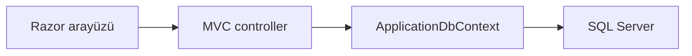

<div align="center">

# Kütüphane Otomasyonu

**Kitap, üye ve ödünç yönetimi**


[](LICENSE)

Kitap envanteri, üye kayıtları ve ödünç/iade süreçlerini ortak bir web arayüzünde yöneten kütüphane uygulaması.

</div>

---

## Öne Çıkanlar

- Kitap, yazar ve kategori yönetimi
- Admin, personel ve üye rolleri
- Teslim tarihi, gecikme takibi ve raporlama

## Teknolojiler

C# · ASP.NET Core 8 MVC · EF Core

## Teknik yaklaşım

Books, Members, Loans ve Reports controller’ları kütüphane işlemlerini ayırır. ApplicationDbContext SQL Server erişimini, session yapılandırması oturum verisini yönetir.



## Kodu incelemeye başlayın

- [LibraryAutomation1/Controllers/BooksController.cs](LibraryAutomation1/Controllers/BooksController.cs)
- [LibraryAutomation1/Controllers/HomeController.cs](LibraryAutomation1/Controllers/HomeController.cs)
- [LibraryAutomation1/Controllers/LoansController.cs](LibraryAutomation1/Controllers/LoansController.cs)
- [LibraryAutomation1/Controllers/MembersController.cs](LibraryAutomation1/Controllers/MembersController.cs)

## Kapsam ve sınırlar

Üretim kullanımı öncesinde rol kontrolleri ve veri erişimi ayrıca incelenmelidir; middleware yapılandırması tek başına tüm uç noktaların yetkilendirildiğini kanıtlamaz.

<details>
<summary><strong>Kurulum, kullanım ve teknik ayrıntılar</strong></summary>

Bu proje, modern web teknolojileri kullanılarak geliştirilmiş, kütüphane operasyonlarını dijitalleştirmeyi amaçlayan kapsamlı bir **ASP.NET Core 8.0 MVC** uygulamasıdır. Kitap yönetiminden üye işlemlerine, ödünç alma süreçlerinden raporlamaya kadar bir kütüphanede ihtiyaç duyulan tüm temel işlevleri kapsamaktadır.

---

 Projenin Amacı
---

Bu projenin temel amacı, kütüphane yönetim süreçlerini dijitalleştirerek daha hızlı, güvenli ve verimli bir sistem oluşturmaktır. Bu kapsamda:

- Kitap envanterinin merkezi olarak yönetilmesi  
- Üye kayıt ve yetkilendirme işlemlerinin düzenlenmesi (Admin, Personel, Üye)  
- Ödünç alma ve iade süreçlerinin otomatik hale getirilmesi  
- Gecikmiş kitapların takip edilmesi  
- İstatistiksel raporların oluşturulması  

---

 Temel Özellikler
---

## Kitap Yönetimi

- Kitap ekleme, güncelleme ve silme (CRUD işlemleri)  
- Kitap kapak görseli yükleme  
- Kitapların müsaitlik durumunun takip edilmesi  
- Tür, yazar ve yayınevine göre filtreleme  

---

## Üye ve Yetki Yönetimi

- Rol bazlı yapı: Admin, Personel, Üye  
- Güvenli kullanıcı giriş sistemi  
- Şifre hashleme ile güvenlik  
- Üye profil ve okuma geçmişi takibi  

---

## Ödünç Alma Sistemi

- Kitap ödünç alma ve iade işlemleri  
- Teslim tarihi takibi  
- Gecikme kontrol mekanizması  
- Kullanıcı bazlı işlem geçmişi  

---

## Raporlama

- En çok okunan kitaplar  
- En aktif üyeler  
- Geciken kitap listesi  
- Kategori bazlı analizler  
- Popüler içerik istatistikleri  

---

 Teknik Detaylar
---

| Özellik | Açıklama |
|----------|----------|
| Dil | C# |
| Framework | ASP.NET Core 8.0 MVC |
| Veritabanı | SQLite / MS SQL Server (EF Core 8.0) |
| Frontend | HTML5, CSS3 (Bootstrap 5), JavaScript (jQuery) |
| Güvenlik | Password Hashing, Role-Based Authorization |
| Mimari | MVC (Model-View-Controller) |

---

 Implementasyon Detayları
---

Proje, Entity Framework Core 8.0 kullanılarak geliştirilmiş modern bir veri mimarisine sahiptir. Tüm veritabanı işlemleri C# modelleri üzerinden yönetilmektedir.

### Kitap Modeli

```csharp
public class Book
{
    public int Id { get; set; }

    [Required(ErrorMessage = "Kitap adı zorunludur.")]
    public string Title { get; set; }

    public string Author { get; set; }

    public bool IsAvailable { get; set; } = true;

    // İlişkisel yapılar
    public virtual ICollection<Loan> Loans { get; set; }
    public virtual ICollection<BookRating> BookRatings { get; set; }
}
```

---

Uygulama, `Program.cs` içerisinde yapılandırılan servis mimarisi ile çalışır ve Session yönetimi sayesinde kullanıcı deneyimi optimize edilmiştir.

---

 Kurulum ve Çalıştırma
---

1. Projeyi indirip klasöre çıkarın  
2. `LibraryAutomation1.sln` dosyasını Visual Studio 2022 ile açın  
3. Package Manager Console üzerinden:

```bash
Update-Database
```

komutunu çalıştırın  

4. Gerekli NuGet paketlerinin yüklü olduğundan emin olun  
5. F5 ile projeyi başlatın  

---

 Proje Yapısı
---

```
LibraryAutomation1-master/
├── LibraryAutomation1/
│   ├── Controllers/   # İş mantığı (Controller katmanı)
│   ├── Models/        # Veritabanı modelleri
│   ├── Views/         # Razor UI dosyaları
│   ├── Data/          # DbContext ve veritabanı yapılandırması
│   ├── wwwroot/       # Statik dosyalar (CSS, JS, görseller)
│   └── Program.cs     # Uygulama başlangıç noktası
├── LibraryAutomation1.sln
└── LICENSE
```

---


</details>

---

<div align="center">

**© 2024 Şilan PEHLİVAN, Merve BARIŞIK, Sevgi GOLGİYAZ and Emira Meryem ERKAN**

Bu proje MIT lisansı kapsamında sunulmaktadır. Kullanım ve dağıtım koşulları: [LICENSE](LICENSE).

</div>
